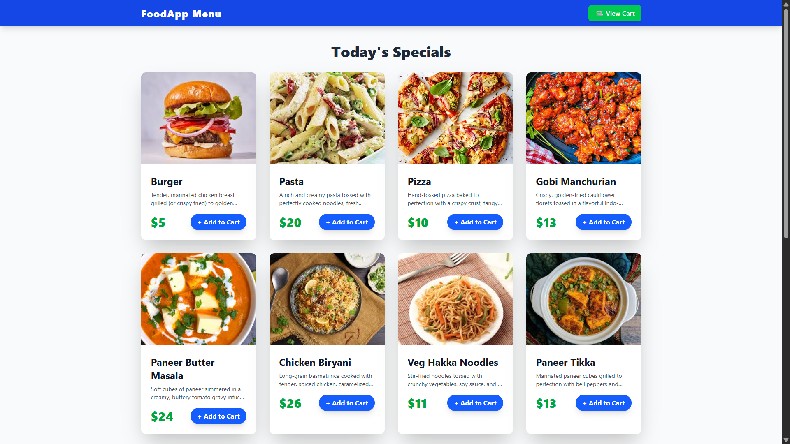
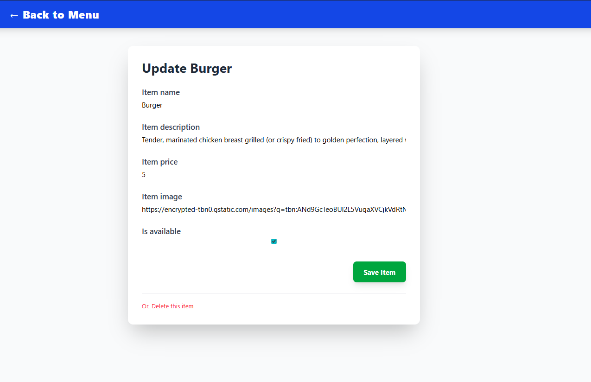
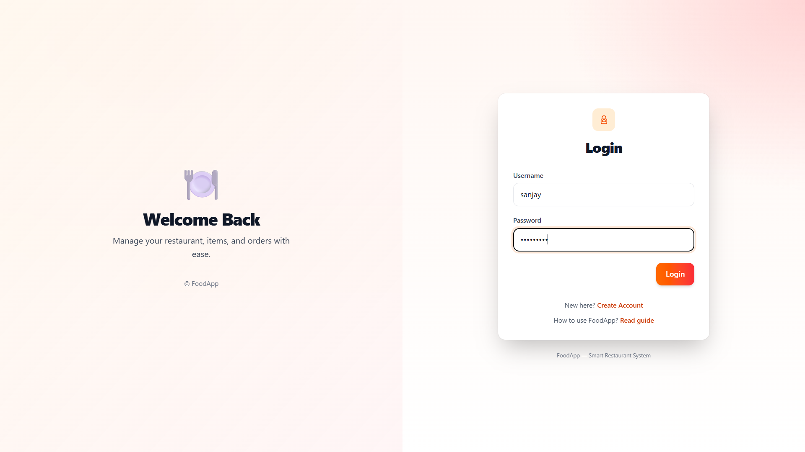
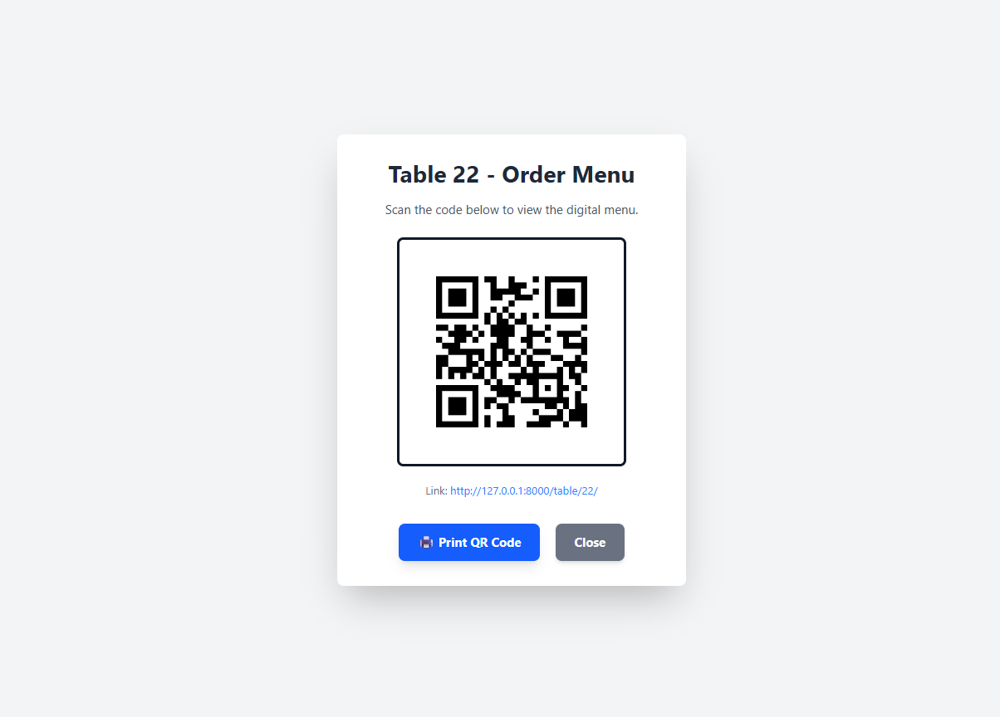
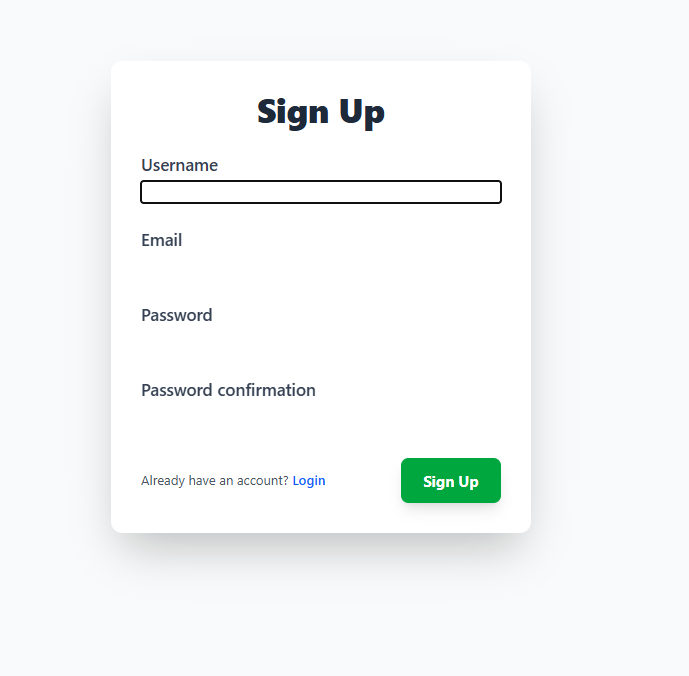
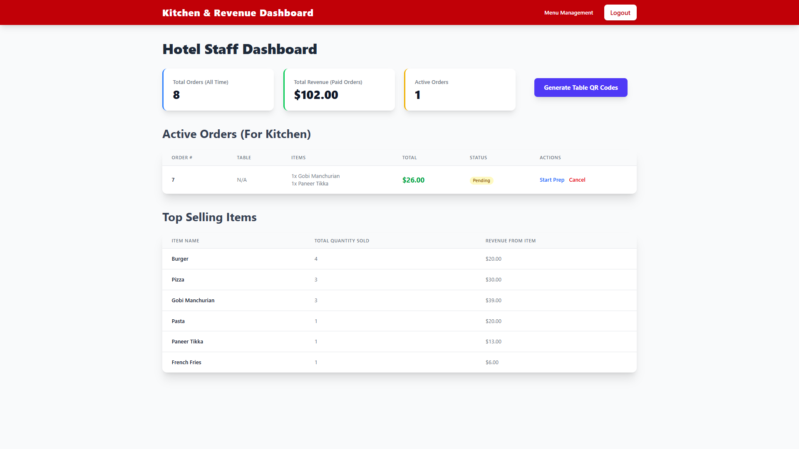
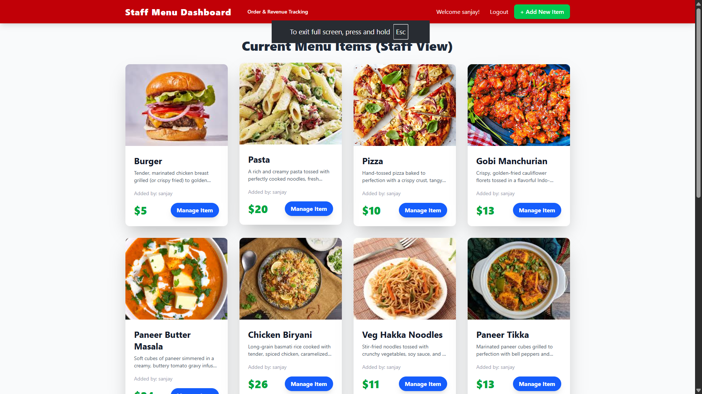
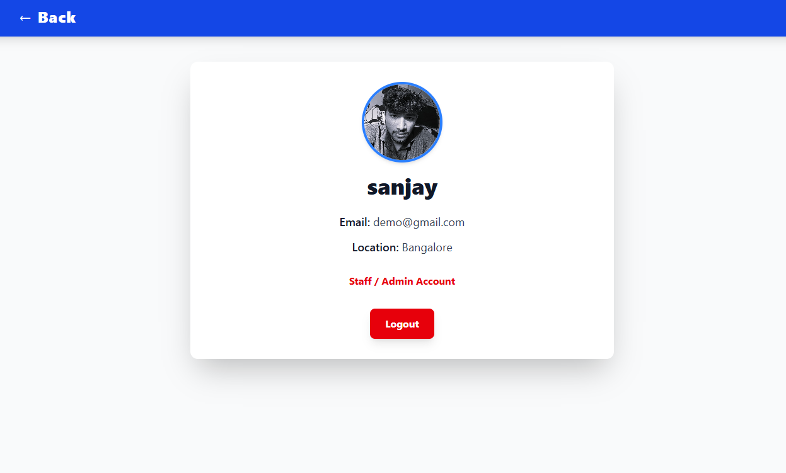

# 📸 Screenshots

---

### 🛒 Customer Menu Page
<p align="center">
  
</p>
Displays the full digital menu that customers see after scanning the QR code.

---

### ✏️ Update Item Page (Staff)
<p align="center">
  
</p>
Staff can update food items, change availability, and edit pricing.

---

### 🔐 Login Page
<p align="center">
  
</p>
Secure staff login required to access management dashboard.

---

### 📱 QR Code for Tables
<p align="center">
  
</p>
Each table receives a unique QR code for ordering.

---

### 🧾 Registration Page
<p align="center">
  
</p>
Staff can register new accounts if allowed.

---

### 🧑‍🍳 Staff Dashboard
<p align="center">
  
</p>
Central hub showing active orders, statuses, and actions.

---

### 🍽️ Staff Menu Management
<p align="center">
  
</p>
Interface for staff to add or edit menu items.

---

### 👤 Staff Profile Page
<p align="center">
  
</p>
Displays staff account information and settings.

---

# 🍽️ FoodApp: Hotel Menu & Order Tracking System

FoodApp is a modern Django application that provides QR-based digital menus for customers and a real-time order tracking system for hotel/restaurant staff.

---

# ✅ Key Features

## 👨‍🍳 Staff / Admin Features
- Secure login (staff only)
- Full menu CRUD management
- Toggle item availability
- Generate QR codes for tables
- Real-time order dashboard
- Update order status (Pending → Preparing → Completed/Paid)
- View detailed order breakdown
- Revenue analytics (total orders, revenue, top-selling items)

---

## 📱 Customer Features
- Scan QR to access digital menu
- Add items to cart (session-based)
- Quick order placement
- Table auto-detected from QR
- Mobile-optimized UI using TailwindCSS

---

# 💻 Technology Stack

- Django 5.0.7  
- SQLite  
- Tailwind CSS (CDN)  
- qrcode + Pillow  
- Gunicorn  

---

## ⚙️ Setup & Installation

---

### 1️⃣ Clone Repository

```
git clone https://github.com/SanjayMarathi/Food-Menu.git
cd mysite
```
---
### 2️⃣ Create & Activate Virtual Environment
Copy code
```
python -m venv venv
```
Windows:
Copy code
```
.\venv\Scripts\activate
```
macOS/Linux:
Copy code
```
source venv/bin/activate
```
---
### 3️⃣ Install Dependencies
Copy code
```
pip install -r requirements.txt
```
If requirements.txt is missing:
Copy code
```
pip install django gunicorn qrcode pillow
```
---
### 4️⃣ Apply Migrations
Copy code
```
python manage.py makemigrations myapp
python manage.py migrate
```
---
### 5️⃣ Create Superuser
Copy code
```
python manage.py createsuperuser
```
---
### 6️⃣ Run Server
Copy code
```
python manage.py runserver
```
---
App available at:

Copy code
```
http://127.0.0.1:8000/
```
🚦 Usage Guide
✅ Staff / Admin Workflow
Login: /users/login/
```
Menu Management: http://127.0.0.1:8000/management/
```
Generate QR Codes:``` http://127.0.0.1:8000/management/dashboard/```

Track & update orders

View revenue reports

✅ Customer Workflow
Scan QR or open URL like:
```
http://127.0.0.1:8000/table/101/
```
Browse menu & add items to cart

Place order → instantly visible on staff dashboard

