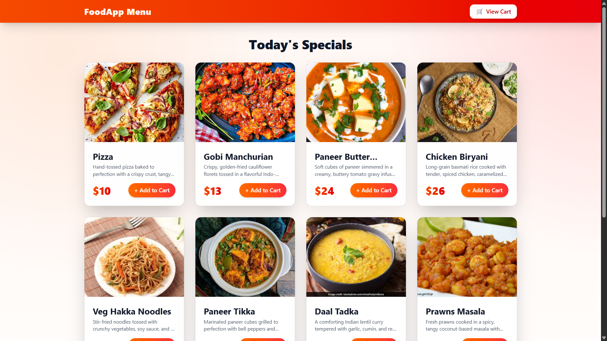
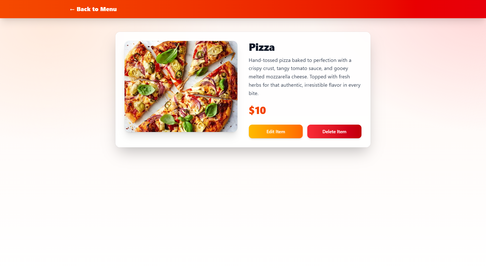
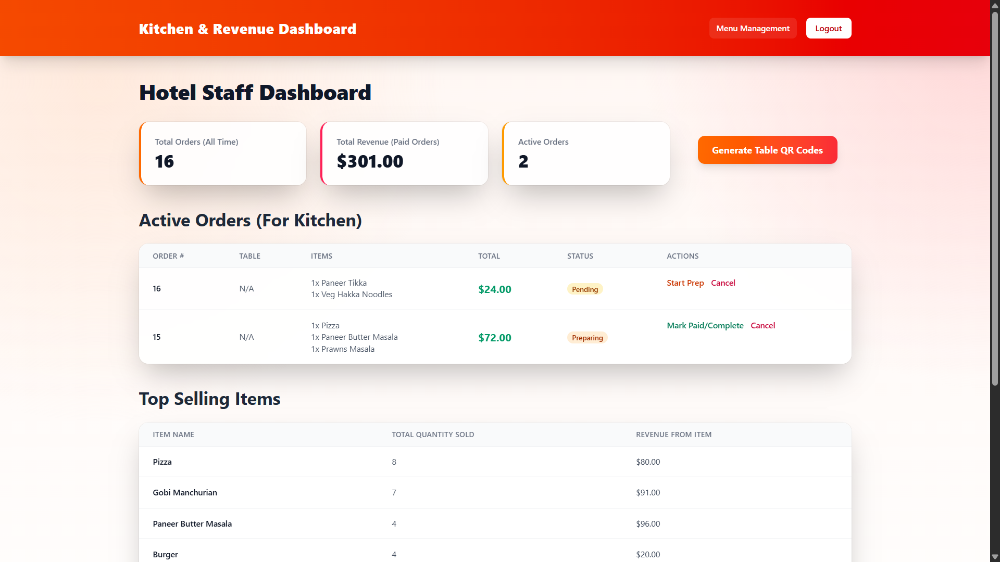
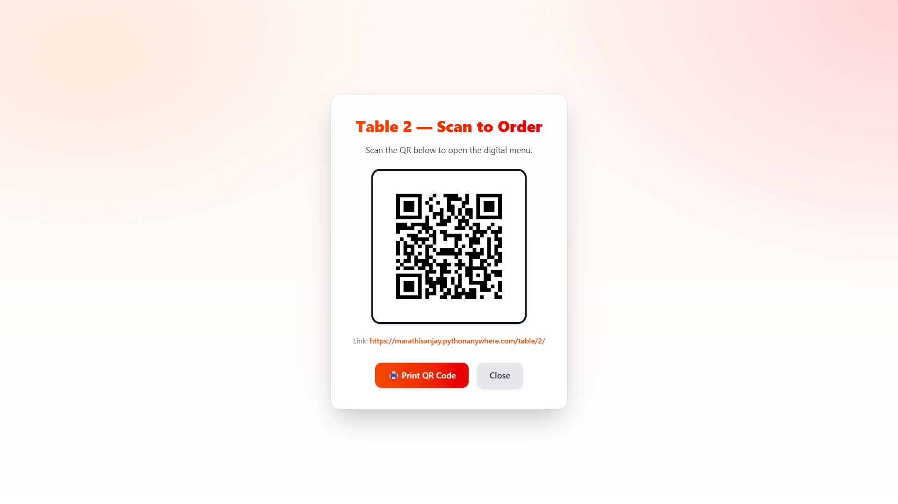
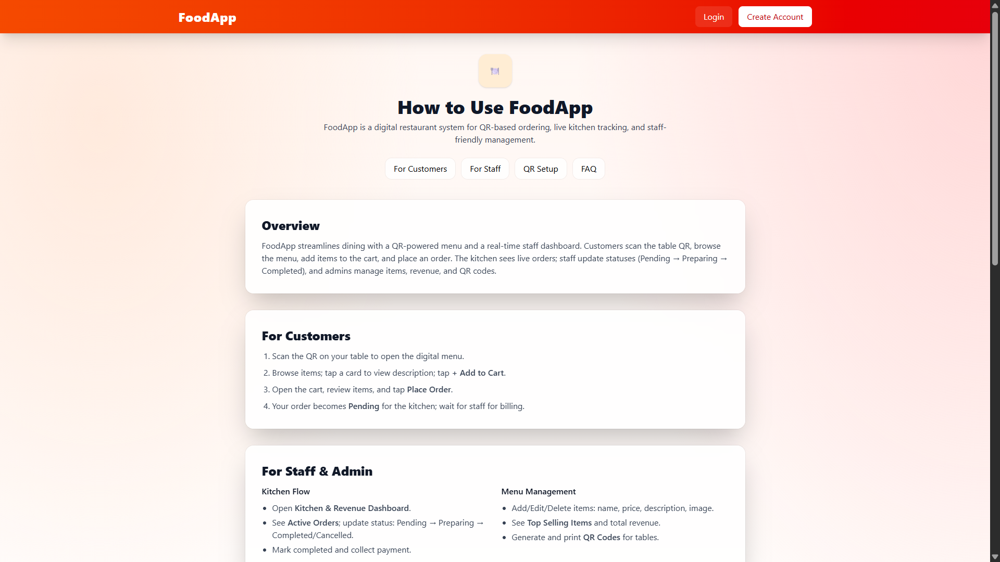

# 📸 Screenshots
### <p align="center">🍽️ Customer Menu Page</p>
<p align="center">
  
</p>
<p align="center">
  Main digital menu shown after scanning the table QR. Displays all food items with name, price, image, and short description.
</p>

---

### <p align="center">🍛 Item Detail Card (Expanded View)</p>
<p align="center">
  
</p>
<p align="center">
  Opens when a customer taps on a dish. Shows a bigger image, detailed description, and an <b>Add to Cart</b> button.
</p>

---

### <p align="center">🛒 Cart Page</p>
<p align="center">
  
</p>
<p align="center">
  Displays selected items with quantity, per-item total, and the final <b>Place Order</b> button.
</p>

---

### <p align="center">📈 Kitchen & Revenue Dashboard</p>
<p align="center">
  
</p>
<p align="center">
  Provides totals, revenue, and best-selling items — helping staff monitor daily performance.
</p>

---

### <p align="center">🍽️ Staff Menu Management</p>
<p align="center">
  
</p>
<p align="center">
  Admin-side grid of all menu items with edit, delete, and view options.
</p>

---

### <p align="center">✏️ Update Item Page (Staff)</p>
<p align="center">
  
</p>
<p align="center">
  Edit item details such as name, description, price, and image in a clean form layout.
</p>

---

### <p align="center">🔐 Login Page</p>
<p align="center">
  
</p>
<p align="center">
  Simple and secure login page for staff with a modern theme.
</p>

---

### <p align="center">🧾 Registration Page</p>
<p align="center">
  
</p>
<p align="center">
  Staff account creation form with live validation and themed UI.
</p>

---

### <p align="center">📱 QR Code for Tables</p>
<p align="center">
  
</p>
<p align="center">
  Printable table QR codes that directly open the table-specific digital menu.
</p>

---

### <p align="center">📘 How to Use Page</p>
<p align="center">
  
</p>
<p align="center">
  Step-by-step guide explaining customer flow, staff actions, QR usage, and FAQs.
</p>


---

# 🍽️ FoodApp – QR Based Digital Menu & Ordering System

FoodApp is a modern Django project that provides:
✅ A QR-based digital menu for customers  
✅ A simple order-tracking panel for staff  
✅ Menu management (CRUD)  
✅ Session-based cart system  

This is **not a restaurant management system** — it is a **lightweight food ordering system** for tables using QR codes.

---

# ✅ Key Features

## 👨‍🍳 Staff / Admin Features
```
• Secure staff login  
• Add, edit, delete menu items  
• Upload item images  
• Toggle item availability  
• Track active orders  
• Update order status  
• Generate QR codes for tables  
• View revenue & top-selling items  
```

---

## 📱 Customer Features
```
• Scan QR code → instantly open menu  
• Browse items with images  
• Tap item card → view description  
• Add items to cart (session-based)  
• Place order quickly  
• Auto-detected table number  
```

---

# 💻 Technology Stack
```
Backend: Django 5  
Frontend: Tailwind CSS (CDN)  
Database: SQLite / MySQL  
QR Code: qrcode + Pillow  
Deployment: Gunicorn / PythonAnywhere  
```

---

# ⚙️ Setup & Installation

### 1️⃣ Clone Repository
```
git clone https://github.com/SanjayMarathi/Food-Menu.git
cd mysite
```

---

### 2️⃣ Create & Activate Virtual Environment
```
python -m venv venv
```

**Windows**
```
.\venv\Scripts\activate
```

**macOS/Linux**
```
source venv/bin/activate
```

---

### 3️⃣ Install Dependencies
```
pip install -r requirements.txt
```

If requirements.txt is missing:
```
pip install django gunicorn qrcode pillow
```

---

### 4️⃣ Apply Migrations
```
python manage.py makemigrations myapp
python manage.py migrate
```

---

### 5️⃣ Create Superuser
```
python manage.py createsuperuser
```

---

### 6️⃣ Run Server
```
python manage.py runserver
```

App opens at:

```
http://127.0.0.1:8000/
```

---

# 🚦 Usage Guide

## ✅ Staff / Admin Workflow
```
1. Login → /users/login/
2. Manage Menu → Add / Edit / Delete items
3. Generate Table QR → Staff Dashboard
4. Track Customer Orders (Pending → Preparing → Completed)
5. View revenue and best-seller stats
```

Dashboard:
```
http://127.0.0.1:8000/management/dashboard/
```

---

## ✅ Customer Workflow
```
1. Scan table QR code
2. Browse menu for that table
3. Add items to cart
4. Place order
5. Order appears instantly on staff dashboard
```

Example table link:
```
http://127.0.0.1:8000/table/101/
```

---

# ✅ Project Structure
```
FoodApp/
│── myapp/
│   ├── templates/
│   │   ├── menu.html
│   │   ├── cart.html
│   │   ├── staff_dashboard.html
│   │   ├── item_detail.html
│   │   ├── how_to_use.html
│   │   ├── create_item.html
│   │   └── login.html / register.html
│   ├── models.py
│   ├── views.py
│   ├── urls.py
│   ├── forms.py
│   └── qr_utils.py
│
│── static/
│── manage.py
│── requirements.txt
```
---

# ✅ Author
```
Developed by: Sanjay Marathi
GitHub: https://github.com/SanjayMarathi
```

---

